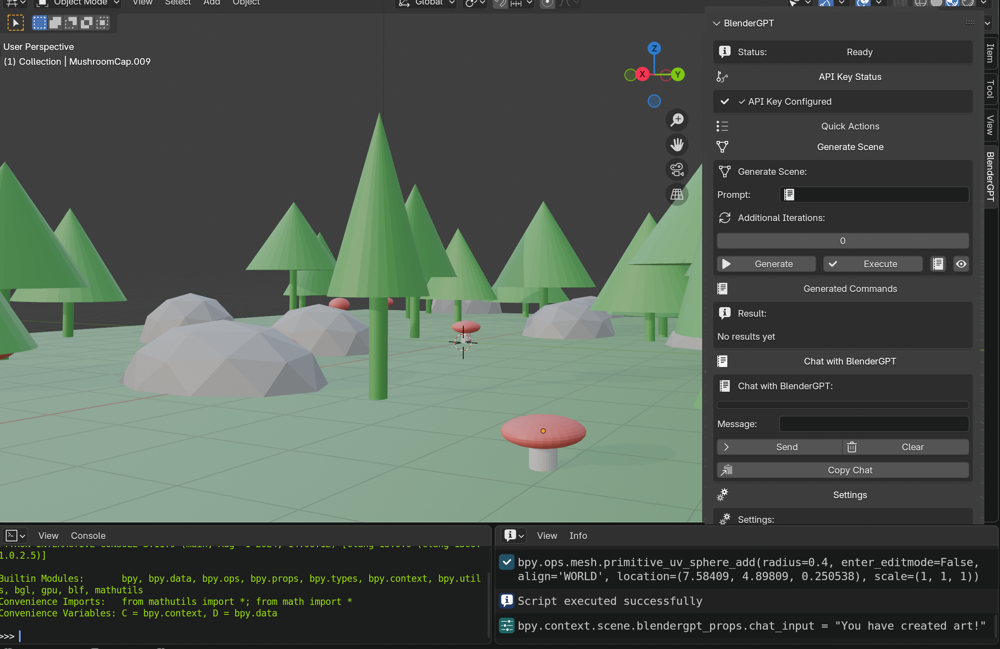
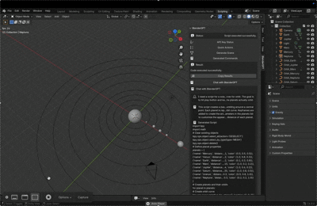

<div align="center">
    
</div>

## BlenderGPT

BlenderGPT is a powerful and flexible Blender addon that harnesses the power of AI to generate and execute Python scripts for creating 3D scenes based on natural language prompts. Whether you're a beginner looking to create a scene with a simple description or an advanced user refining a complex project, BlenderGPT offers an intuitive interface to bring your ideas to life. You can interact with the AI through a chat system or use direct prompts to generate scenes, making it adaptable to a wide range of workflows.

<div align="center">
    
    <p style="font-size: small; font-style: italic;">BlenderGPT can even create animated elements.</p>
</div>

## Features

- **Natural Language Scene Generation**:
  - Describe your scene in plain English (e.g., "Create a forest with trees, mushrooms, and rocks" or "Build an animated solar system with planets orbiting the sun using keyframes"), and BlenderGPT will generate a Blender Python script to build it.
  - Execute the script immediately to see your scene come to life in Blender.

- **Flexible Interaction Methods**:
  - **Chat Interface**: Use the chat system to have a conversation with BlenderGPT. Ask questions, request scripts, or refine your scene step-by-step. For example, you can start with "Can I have a solar system model?" and follow up with "Make it animated with keyframes" to iteratively build your scene.
  - **Direct Prompt in Generate Scene**: Enter a prompt in the "Generate Scene" section for a more straightforward approach. This is perfect for one-off scene generation or when you know exactly what you want.

- **Iterative Scene Enhancement**:
  - Refine your scene over multiple iterations by adding complementary elements. For example, after creating a forest, you can add rocks, wildlife, or a river in subsequent iterations.
  - Each iteration includes a 1-second pause for visual feedback, and you can cancel at any time by pressing the Esc key.
  - A progress bar tracks the current iteration and percentage completion during iterative generation.

- **Script Execution from Chat**:
  - When using the chat, if you request a script (e.g., "Write a script to create a solar system with animated orbits"), BlenderGPT will generate the script and display it in the chat.
  - Click the "Execute Script" button directly in the chat to run the script and see the result in your Blender scene—no need to copy or paste.

- **Quick Actions**:
  - Add common elements like cubes, lights, or cameras with a single click, or clear the scene instantly.
  - These actions are great for quick prototyping or setting up a scene before using AI to enhance it.

- **Chat Interface**:
  - Interact with BlenderGPT to generate scripts, ask questions, or refine your scene through a simple chat interface.
  - View the full chat history, clear it with the "Clear" button, or copy it to your clipboard with "Copy Chat" for easy sharing.
  - Click on any line of a message in the chat to view the full message in a popup, making it easy to read longer responses.

- **API Key Management**:
  - View API key status in the UI to ensure it's configured correctly.
  - Load an API key from a file or set it in the addon preferences (`Edit > Preferences > Add-ons > BlenderGPT`).
  - The API key is saved to a `config.json` file beside the addon for persistence.

- **Safe Script Execution**:
  - Scripts are validated to prevent unsafe commands (e.g., `os.system`, `eval`, `sys`), ensuring a secure workflow.
  - Execution results are displayed in the "Result" section, with detailed error messages if something goes wrong.

- **Customizable Settings**:
  - Toggle "Low Detail Mode" to reduce the amount of scene information sent to the API, improving response time for complex scenes.
  - Adjust the "Chat Height" to control the number of visible rows in the chat history.
  - Select your preferred GPT model (e.g., GPT-4o Mini, GPT-4) in the addon preferences to balance speed and quality.

- **Progress Tracking and Feedback**:
  - Monitor iterative generation with a progress bar showing the current iteration and percentage completion.
  - The "Status" section provides real-time updates on what BlenderGPT is doing (e.g., "Generating response...", "Script executed successfully").
  - Execution results are shown in the "Result" section, with an option to copy them to your clipboard.

- **Detailed Logging**:
  - View logs in the Blender console, including scene analysis, generated prompts, and executed scripts for each iteration. This is useful for debugging or understanding what the AI is doing.

- **Easy Access**:
  - Find BlenderGPT in the Sidebar under `View3D > Sidebar > BlenderGPT`, making it seamlessly integrated into your Blender workflow.

## Installation

1. **Download the Addon**:
   - Clone or download this repository from `https://github.com/virtualdmns/blender-gpt`.

2. **Install in Blender**:
   - Open Blender and go to `Edit > Preferences > Add-ons`.
   - Click `Install`, then select the downloaded `BlenderGPT.zip` file (or the directory containing `BlenderGPT.py` if not zipped).
   - Enable the addon by checking the box next to "BlenderGPT".

3. **Configure API Key**:
   - **Option 1: Manual Configuration**:
     - Create a `config.json` file in the addon directory with your OpenAI API key in the format:
       ```json
       {
         "openai_api_key": "your-api-key-here"
       }
       ```
     - The addon will automatically load this key on startup.
   - **Option 2: Set in Preferences**:
     - Go to `Edit > Preferences > Add-ons`.
     - Find "BlenderGPT" in the list and expand its preferences.
     - Enter your OpenAI API key in the "OpenAI API Key" field. It will be saved to `config.json` automatically.
   - **Option 3: Load from File**:
     - Open the BlenderGPT panel in the Sidebar (`View3D > Sidebar > BlenderGPT`).
     - Expand the "API Key Status" section.
     - If no API key is found, click "Load API Key" to select a `.json` file containing your API key.

4. **Install Dependencies**:
   - Ensure the `openai` and `requests` Python packages are installed for Blender's Python environment:
     ```bash
     /Applications/Blender.app/Contents/Resources/4.3/python/bin/python3.11 -m pip install openai requests
     ```
   - On Windows, the path might be:
     ```bash
     "C:\Program Files\Blender Foundation\Blender 4.3\4.3\python\bin\python.exe" -m pip install openai requests
     ```

## Usage

BlenderGPT is designed to be flexible, allowing you to interact with it in the way that best suits your workflow. Below are the two main ways to use it, along with additional features to enhance your experience.

1. **Access the Panel**:
   - Open the BlenderGPT panel in the Sidebar: `View3D > Sidebar > BlenderGPT`.

2. **Configure Your API Key**:
   - Check the "API Key Status" section to see if an API key is configured.
   - To set your API key, go to `Edit > Preferences > Add-ons > BlenderGPT` and enter your OpenAI API key in the preferences.
   - Alternatively, if no API key is configured, use the "Load API Key" button in the "API Key Status" section to load it from a file.

3. **Generate a Scene Using the "Generate Scene" Section**:
   - Expand the "Generate Scene" section.
   - Enter a prompt (e.g., "Create a forest with trees and a river" or "Build an animated solar system with planets orbiting the sun using keyframes").
   - Set the number of additional iterations (e.g., 2 iterations to add rocks and wildlife to a forest).
   - Click "Generate" to create the script.
   - Click "Execute" to apply the script to your Blender scene.
   - Use the "Preview" button to view the generated script in a popup before executing it.
   - During iterative generation, a progress bar will show the current iteration, and you can press Esc to cancel if needed.

4. **Generate and Execute Scripts Using the Chat Interface**:
   - Expand the "Chat with BlenderGPT" section.
   - Type a message (e.g., "Can I have a model of a solar system? The orbits should be represented by curves.") and click "Send".
   - The AI will respond with a description and, if requested, a script. For example, follow up with "Write the actual script" to get a script you can execute.
   - If a script is generated, it will be displayed below the message with an "Execute Script" button. Click the button to run the script directly in Blender.
   - Click on any line of a message in the chat to view the full message in a popup, which includes a "Copy Message" button to copy the message content.
   - Use the "Clear" button to clear the chat history or the "Copy Chat" button to copy the entire chat history (including scripts) to your clipboard.

5. **Use Quick Actions**:
   - Expand the "Quick Actions" section.
   - Click buttons like "Add Cube", "Add Light", "Add Camera", or "Clear Scene" to quickly modify your scene. These are great for setting up a scene before using the AI to enhance it.

6. **Monitor Progress and Results**:
   - The "Status" section provides real-time updates on the current operation (e.g., "Generating response...", "Script executed successfully").
   - View the generated script in the "Generated Commands" section, where you can copy or clear the script.
   - See execution results in the "Result" section, with an option to copy them to your clipboard for debugging or sharing.

7. **Adjust Settings**:
   - Expand the "Settings" section.
   - Enable "Low Detail Mode" to reduce scene info sent to the API for faster responses, especially useful for complex scenes.
   - Adjust "Chat Height" to control the number of visible rows in the chat history, making it easier to navigate long conversations.

## Example Scenarios

### Scenario 1: Direct Scene Generation
- **Prompt**: "Create a forest with trees, rocks, mushrooms, and plants."
- **Iterations**: 2
- **Steps**:
  1. In the "Generate Scene" section, enter the prompt and set iterations to 2.
  2. Click "Generate" to create the script, then "Execute" to build the forest.
  3. BlenderGPT will add complementary elements (e.g., wildlife or a river) in two additional iterations.
- **Result**: A fully realized forest scene with trees, rocks, mushrooms, plants, and additional elements like animals or water.

### Scenario 2: Chat-Based Scene Building
- **Chat Messages**:
  1. "Can I have a prompt for a model of a solar system? The orbits should be represented by curves."
  2. "I need all planets."
  3. "Can you write the actual script to animate the orbits over time with keyframes?"
- **Steps**:
  1. In the "Chat with BlenderGPT" section, send the first message.
  2. BlenderGPT might respond with a description of a script for a solar system with two planets.
  3. Send the second message to request all planets.
  4. BlenderGPT provides the script with an "Execute Script" button.
  5. Click "Execute Script" to create an animated solar system with all planets orbiting the sun using keyframes.
- **Result**: An animated solar system with all major planets, orbits as curves, and keyframes for animation, all built through a conversational workflow.

## Flexibility

BlenderGPT is designed to be highly flexible, adapting to your creative process:

- **Conversational or Direct**: Use the chat interface for an iterative, conversational approach, or go straight to the "Generate Scene" section for a one-shot scene creation. Both methods can generate and execute scripts, so you can choose what works best for you.
- **Granular Control**: Start with a basic scene using Quick Actions (e.g., add a cube or light), then enhance it with AI-generated scripts via chat or direct prompts.
- **Iterative Refinement**: Whether through the chat or the "Generate Scene" section, you can refine your scene over multiple iterations, adding new elements each time.
- **Script Execution Anywhere**: Execute scripts directly from the chat or the "Generate Scene" section, making it easy to test ideas without leaving the addon.
- **Customizable Experience**: Adjust settings like Low Detail Mode and Chat Height, and choose your preferred GPT model to balance speed, quality, and usability.

## Requirements

- Blender 4.3 or later (as specified in `bl_info`)
- OpenAI API key
- Python packages: `openai>=1.0.0`, `requests>=2.0.0`

## Notes

- Ensure your API key is correctly configured to avoid errors. Check the "API Key Status" section for confirmation.
- The addon includes safety checks to prevent execution of dangerous scripts, ensuring a secure experience.
- Iterations can be resource-intensive depending on the complexity of the scene and the number of iterations. Use Low Detail Mode if responses are slow.

## Contributing

Contributions are welcome! Please submit issues or pull requests to the GitHub repository: `https://github.com/virtualdmns/blender-gpt`.

## License

This project is licensed under the MIT License. See the LICENSE file for details.
