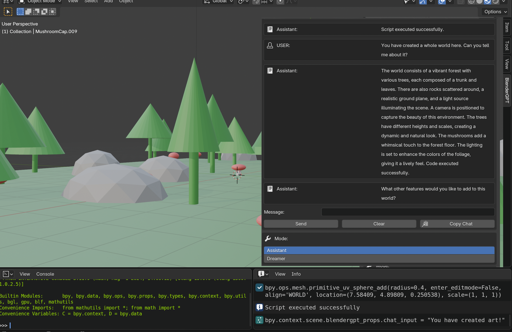

# BlenderGPT

A Blender addon that harnesses the power of GPT to generate and execute Python code for automating tasks in Blender. Describe what you want in natural language—like "Create a forest with realistic trees" or "Add a car with specific materials"—and this addon will whip up the Blender Python code to make it happen. It's nowhere near finished but it is interesting and has potential.

## Features
- **No More MCP**: Completely standalone—no dependencies on external frameworks.
- **Natural Language Input**: Tell it what you want in plain English, and it’ll generate the Python code to make it happen.
- **Code Execution with Undo Support**: Generated code runs in Blender with full undo support, so you can backtrack if shit goes sideways.
- **Customizable GPT Model**: Pick your poison—GPT-4, GPT-3.5 Turbo, or GPT-4o Mini (default)—in the addon preferences.
- **Safe API Key Storage**: Your OpenAI API key is securely stored in a `config.json` file in the addon directory.
- **Real-time Progress Tracking**: A visual progress bar keeps you in the loop on command execution status.
- **Chat Interface with Two Modes**:
  - **Assistant Mode**: Get detailed scene analysis, ask questions, and execute commands directly from the chat. It’s conversational but can generate scripts when you ask for action (e.g., "Add 5 more trees").
  - **Dreamer Mode**: A creative twist that interprets your scene with emotional, energetic, and cosmic insights (e.g., "This forest feels serene with a steady energy flow") and generates a unique script to match the vibe.
- **Smart Command Generation**:
  - Automatic spacing and positioning of objects for a natural layout.
  - Realistic material generation for natural objects (trees, rocks, etc.).
  - Proper hierarchy and parent-child relationships for complex scenes.
  - Intelligent rotation and scale variation to avoid uniformity.
- **Comprehensive Scene Analysis**: Get a full breakdown of your scene—objects, materials, cameras, lights, and more.
- **Dreamer Scene Interpretation**: Unique to Dreamer mode, this feature adds a layer of creativity with emotional tones, energetic flows, and aesthetic textures, making your scenes feel alive and otherworldly.
- **Error Handling and Debugging**: Detailed error messages and logs in the Blender console to help you troubleshoot.

## Requirements
- **Blender Version**: 3.0.0 or higher (tested on Blender 4.3).
- **Python Libraries**:
  - `openai`: Required for GPT integration. Install it via Blender’s Python environment.
- **OpenAI API Key**: Grab one from [OpenAI](https://platform.openai.com/account/api-keys).

## Installation
1. **Download the Addon**:
   - Clone or download this repository to your local machine.

2. **Install Required Python Library**:
   - Open a terminal and navigate to Blender’s Python executable directory:
     - On macOS: `/Applications/Blender.app/Contents/Resources/4.3/python/bin/`
     - On Windows: `C:\Program Files\Blender Foundation\Blender 4.3\4.3\python\bin\`
     - On Linux: `/path/to/blender/4.3/python/bin/`
   - Install the `openai` library:
     ```bash
     ./python3.11 -m pip install openai
     ```

3. **Install the Addon in Blender**:
   - Open Blender.
   - Go to Edit > Preferences > Add-ons.
   - Click "Install" and select the `addon_blender_gpt.py` file.
   - Enable the addon by checking the box next to "Interface: BlenderGPT".

4. **Configure API Key**:
   - In the BlenderGPT panel (View3D > Sidebar > BlenderGPT).
   - Click "Configure API Key".
   - Enter your OpenAI API key.
   - The key will be saved securely in a `config.json` file.

## Usage
1. **Access the Panel**:
   - Open the BlenderGPT panel in the 3D Viewport’s sidebar (View3D > Sidebar > BlenderGPT).

2. **Generate Scene**:
   - Enter your prompt in the "Prompt" field (e.g., "Create a forest with 10 trees").
   - Click "Generate" to create the commands.
   - Review the generated script and explanation.
   - Click "Execute" to apply the changes to your scene.

3. **Chat Interface**:
   - **Assistant Mode**: Use the chat to analyze your scene, ask questions, or execute commands directly (e.g., "Add 5 more mushrooms" or "What’s in the scene?").
   - **Dreamer Mode**: Switch to Dreamer mode for a creative interpretation of your scene, complete with emotional and energetic insights, followed by a unique script (e.g., "This forest feels euphoric with a turbulent flow").
   - Get suggestions for improvements and execute commands from chat responses.

4. **Progress Tracking**:
   - Monitor command execution progress with the progress bar.
   - View detailed results and any errors in the chat or Blender console.
   - Use undo/redo as needed to tweak your scene.

## Examples
- `"Create a forest with 10 trees, each with a unique brown trunk and green foliage."`
- `"Add a car with a red body, black windows, and silver wheels."`
- `"Create a city block with 5 buildings of different heights and materials."`
- `"Generate a landscape with rocks, trees, and a ground plane with a grassy material."`
- `"Add glowing fireflies around the trees in a forest scene."`

## Tips
- Be specific in your prompts for better results (e.g., `"Add 5 tall trees with red foliage"` vs. `"Add trees"`).
- Use the chat interface for detailed explanations and scene analysis.
- Check the generated commands before execution to ensure they match your vision.
- Use undo if the results aren’t what you expected—shit happens, and that’s okay.
- Experiment with Dreamer mode for creative twists on your scenes.
- Switch between GPT models in the preferences to see which one nails your style.

## License
MIT License—feel free to use, modify, and share this addon as you see fit.

## Contributing
Contributions are welcome! Got an idea to make this addon even more badass? Submit a Pull Request, and let’s build something epic together.